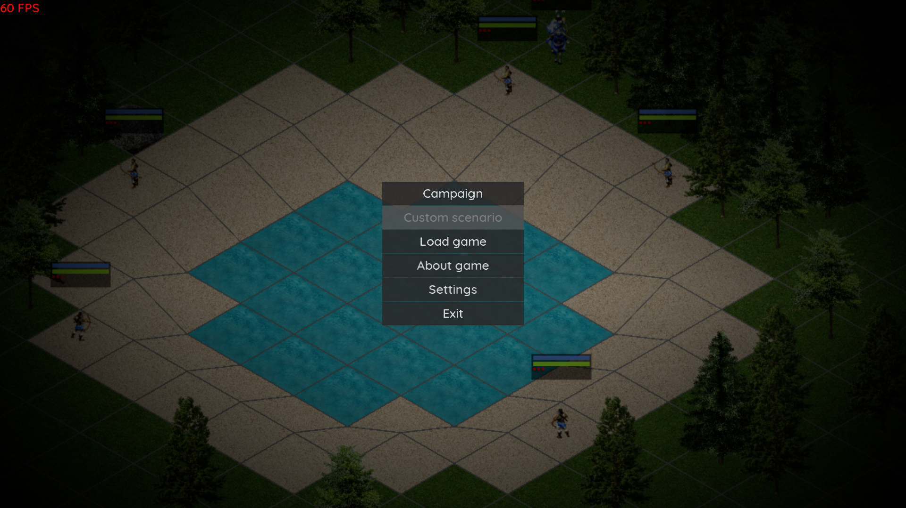
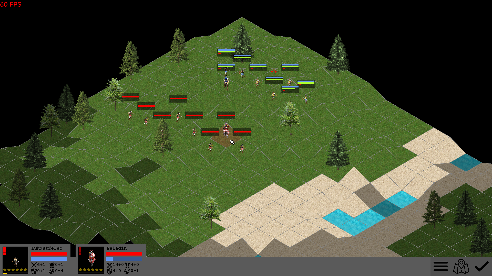

# Spage

Maturitní práce. Tahová strategická hra vykreslovaná v izometrickém protoru. Herní mechanika a grafika jsou založená na hrách Spellcross a Age of Empires II. 

High-School graduation project. Turn-based strategy game rendered using isometric projection, game graphics and mechanics are based on Spellcross and Age of EMpires II.

